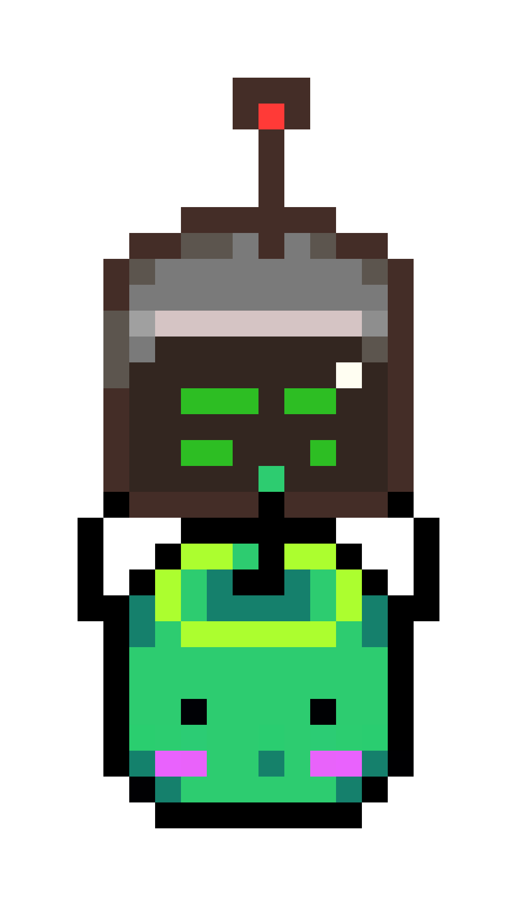

# JunimoOS 像素操作系统

> Making an OS for `x86_64` architecture, with a Stardew Valley style, only for fun. 🚀

## Goals

Here are the current project goals:

- [x] Design a Stardew Valley-style logo

## Tech Stack

- Assembly (`x86_64`)
- C
